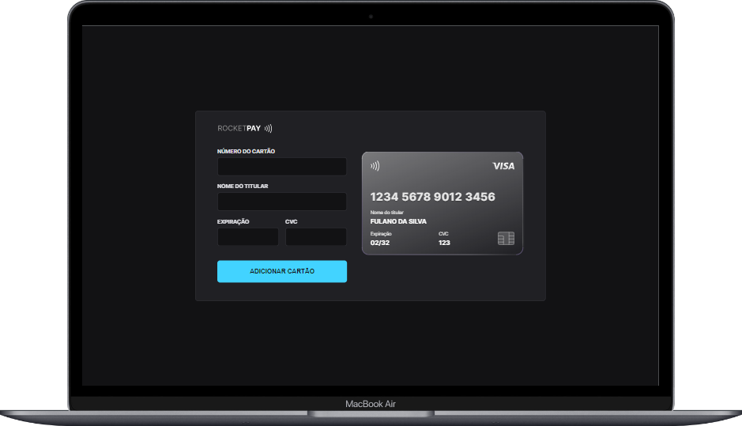
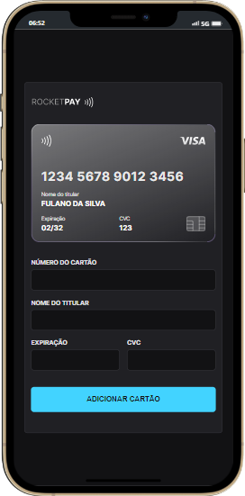

<h1 align="center">
  Explorer Lab #01
</h1>

  <a href="#-layout">Layout</a>&nbsp;&nbsp;&nbsp;|&nbsp;&nbsp;&nbsp;
  <a href="#-tecnologias">Tecnologias</a>&nbsp;&nbsp;&nbsp;|&nbsp;&nbsp;&nbsp;
  <a href="#-projeto">Projeto</a>&nbsp;&nbsp;&nbsp;|&nbsp;&nbsp;&nbsp;
  <a href="#-licença">Licença</a>&nbsp;&nbsp;&nbsp;|&nbsp;&nbsp;&nbsp;
  <a href="#-contato">Contato</a>

 

## 🎨 Layout

Aqui você pode conferir o layout em suas respectivas versões.  

[👉 Link para visualizar a pagina inteira](https://explorer-lab-01-rho-woad.vercel.app/)

### Versão Web 🖥️

 
   

---

### Versão Mobile 📱

 

  

## 🚀 Tecnologias

Esse projeto foi desenvolvido com as seguintes tecnologias:

 

## 💻 Projeto

O Rocketpay é um componente que simula o formulário de preenchimento de cartão de crédito, onde é possível adicionar máscara aos inputs e atualizar elementos HTML via DOM...

## 📝 Licença

Esse projeto está sob a licença MIT. Veja o arquivo [LICENSE](LICENSE) para mais detalhes.

## 🌐 Contato

 

---

Feito com ♥ by Gabriel Gonçalves 🖖 &nbsp;&nbsp;&nbsp;|&nbsp;&nbsp; <a href="#--explorer-lab-01">Voltar para o Inicio ⬆️ </a>
